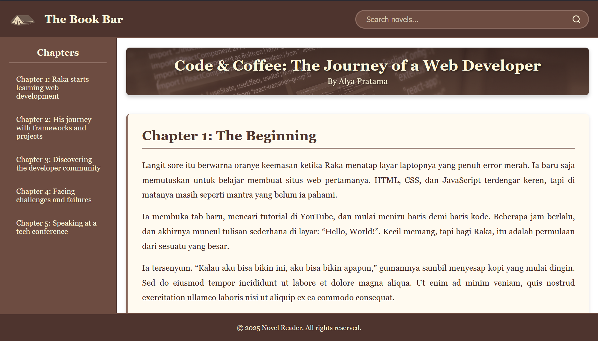

# 📚 The Book Bar - Novel Reader Web Application
[](https://developer.mozilla.org/en-US/docs/Web/HTML)
[](https://developer.mozilla.org/en-US/docs/Web/CSS)
[](https://github.com/SidqiRaafi/Tugas_Kelompok9_Pemrograman_Web)
[](LICENSE)
[](https://github.com/SidqiRaafi/Tugas_Kelompok9_Pemrograman_Web/graphs/commit-activity)

A beautiful, responsive web-based novel reader with warm, coffee-themed aesthetics designed for an immersive reading experience.



## 🌟 Overview

The Book Bar is a modern web application designed to provide readers with a comfortable, distraction-free environment for enjoying digital novels. Inspired by cozy coffee shops and traditional libraries, this reader features a warm color palette and intuitive navigation system.

### Featured Novel
**Code & Coffee: The Journey of a Web Developer** by Alya Pratama - Follow Raka's inspiring journey from coding beginner to conference speaker.

## ✨ Features

- 📖 **Clean Reading Interface** - Distraction-free reading experience with justified text and optimal line spacing
- 🎨 **Warm Coffee Theme** - Cozy brown and cream color palette inspired by coffee shops and old libraries
- 🔍 **Search Functionality** - Quick search bar to find chapters and content
- 📱 **Responsive Design** - Fully responsive layout that works on desktop, tablet, and mobile devices
- 🧭 **Chapter Navigation** - Easy-to-use sidebar with clickable chapter links and smooth scrolling
- 🎯 **Fixed Header & Footer** - Logo and footer remain visible while content scrolls
- ✨ **Smooth Animations** - Elegant hover effects and transitions throughout
- 🖼️ **Banner Image Support** - Customizable header banner for novel cover art

## 🎨 Color Palette

The application uses a carefully selected "Coffee & Cream" color scheme:

| Element | Color Name | Hex Code | Usage |
| ------- | ---------- | -------- | ----- |
| Logo/Header/Footer | Deep Coffee | `#4E342E` | Primary dark background |
| Sidebar | Milk Chocolate | `#6D4C41` | Secondary background |
| Body Background | Vanilla Cream | `#FFF9E6` | Main content area |
| Cards | Floral White | `#FFFAF0` | Chapter sections |
| Text | Dark Brown | `#3E2723` | Primary text color |
| Links/Headings | Deep Coffee | `#4E342E` | Headers and titles |
| Accents | Cappuccino | `#8D6E63` | Borders and highlights |
| Hover | Cinnamon | `#D2691E` | Interactive elements |
| Cream Text | Cornsilk | `#FFF8DC` | Text on dark backgrounds |

## 🛠️ Technologies Used

- **HTML5** - Semantic markup structure
- **CSS3** - Modern styling with:
  - CSS Grid Layout
  - Flexbox
  - Custom scrollbars
  - Responsive media queries
  - Smooth transitions and animations
- **Google Fonts** - Georgia serif font family for enhanced readability

## 📁 Project Structure

Tugas_Kelompok9_Pemrograman_Web/
├── index.html # Main HTML file
├── styles.css # Complete styling
├── assets/
│ ├── images/
│ │ ├── logo.png # Website logo
│ │ ├── banner.jpg # Novel header banner
│ │ └── githubbanner.png # GitHub banner
└── README.md # Project documentation


## 🚀 Getting Started

### Prerequisites

- A modern web browser (Chrome, Firefox, Safari, or Edge)
- Basic text editor (VS Code, Sublime Text, etc.)
- Git (optional, for cloning)

### Installation

1. **Clone the repository:**
```
git clone https://github.com/SidqiRaafi/Tugas_Kelompok9_Pemrograman_Web.git
```

2. **Navigate to the project folder:**
```
cd Tugas_Kelompok9_Pemrograman_Web
```

3. **Open in browser:**
- Simply double-click `index.html`, or
- Right-click `index.html` → Open with → Your Browser

### Live Demo

Visit the live version: [The Book Bar](https://sidqiraafi.github.io/Tugas_Kelompok9_Pemrograman_Web/)

## 💡 Usage

### Reading the Novel

1. Click on any chapter in the **sidebar navigation** to jump to that section
2. Use the **scrollable body area** to read through content
3. The **header banner** displays the novel title and author
4. Use the **search bar** (top right) to find specific chapters

### Customization

To add your own novel:

1. **Edit HTML content** in `index.html`:
```
<section id="chapter-1"> <h2>Your Chapter Title</h2> <p>Your content here...</p> </section>
```
2. **Update header banner:**
- Replace assets/images/banner.jpg with your cover image
- Update title and author in the .header section

3. **Modify colors:**
- Edit CSS variables in styles.css
- Change color hex codes to match your theme

**📱 Responsive Breakpoints**
- Desktop: 1025px and above
- Tablet: 769px - 1024px
- Mobile: 768px and below

**On mobile devices:**
- Sidebar is hidden
- Search bar is hidden
- Layout becomes single column
- Touch-friendly button sizes

**🎯 Key Features Breakdown**
**Grid Layout System**
The application uses CSS Grid for the main structure:
- 3 rows: Logo (80px), Content (flexible), Footer (60px)
- 2 columns in content: Sidebar (250px), Main content (flexible)

**Custom Scrollbars**
- Styled scrollbars for both body and sidebar:
- Cappuccino thumb color (#8D6E63)
- Smooth hover effects
- Consistent with warm theme

**Typography**
- Font Family: Georgia, Times New Roman (serif fonts for readability)
- Body Text: 1.1rem with 1.8 line height for comfortable reading
- Headers: 1.8rem - 2rem for clear hierarchy

🤝 Contributors
This is a group project. Team members:
- Sidqi Raafi
- Natalia Margareta
- Arys Rizki

**📄 License**
This project is licensed under the MIT License - see the LICENSE file for details.

**🙏 Acknowledgments**
- Color palette inspiration from traditional coffee shops and libraries
- Layout design inspired by modern reading applications
- Novel content: "Code & Coffee: The Journey of a Web Developer" by Alya Pratama
- Icons and graphics: Custom designed for this project
- Font: Georgia typeface (system font)

**📧 Contact**
Project Repository: https://github.com/SidqiRaafi/Tugas_Kelompok9_Pemrograman_Web

Maintainer: Sidqi Raafi

Made with ☕ and 💻 by Kelompok 9 - Web Programming Class 2025

